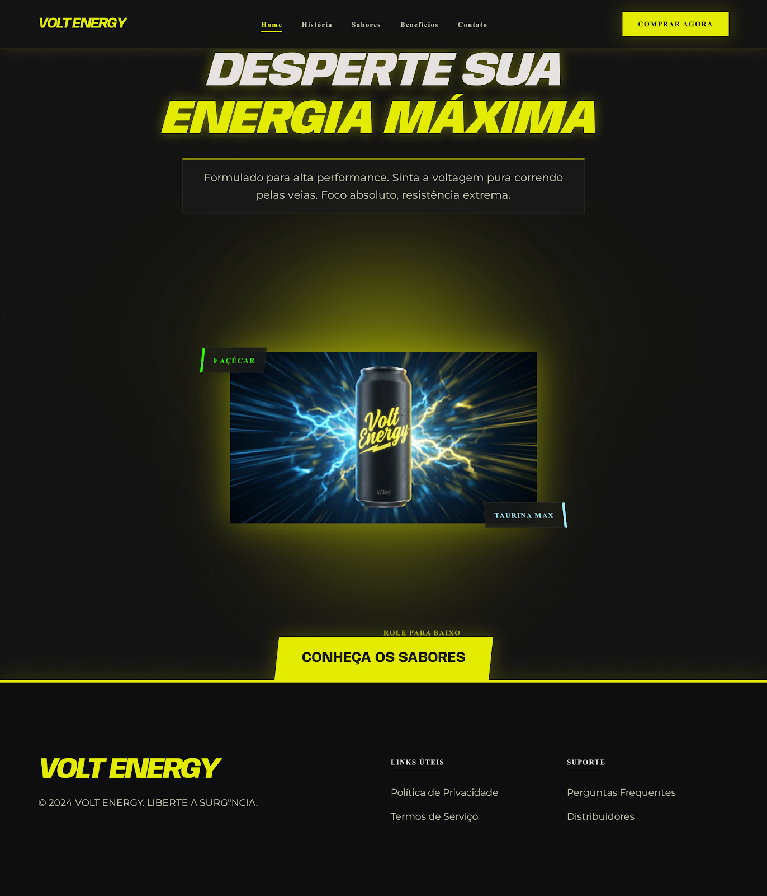
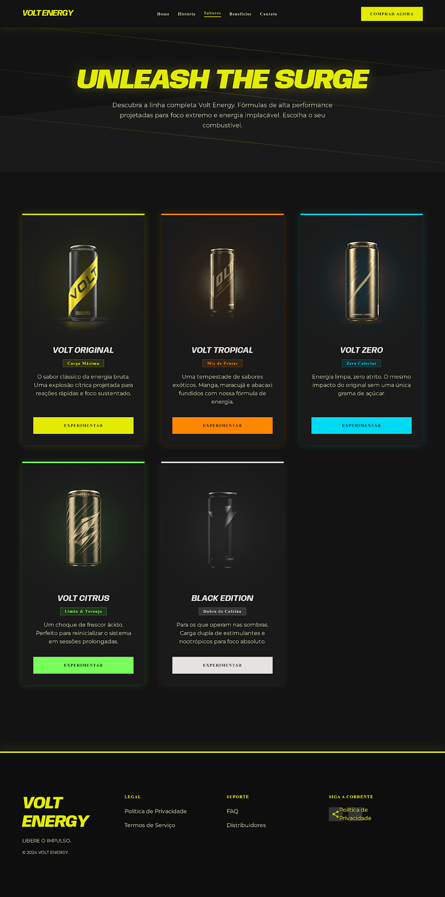
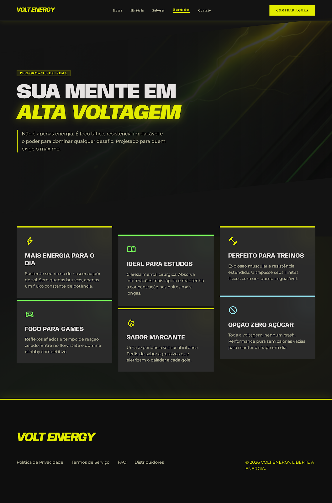
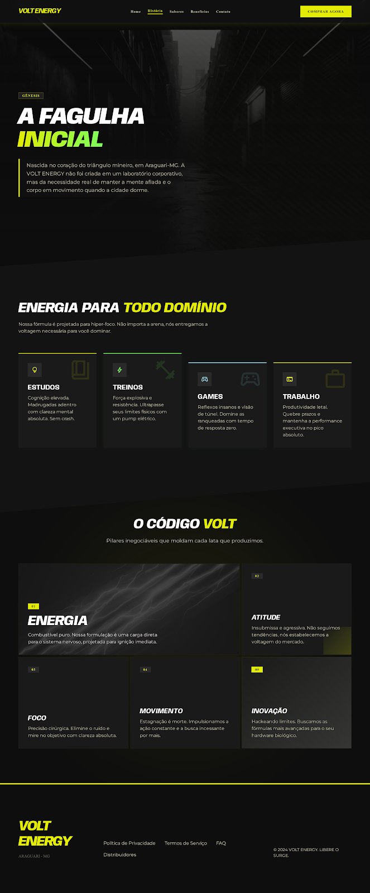
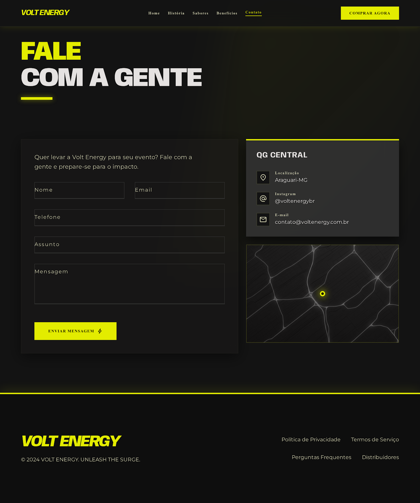

# Volt Energy

Projeto de site para a marca fictícia **Volt Energy**, um energético com identidade visual escura, neon e focada em alta performance.

## Páginas

- `index.html` - Home
- `sabores.html` - Produtos e sabores
- `beneficios.html` - Benefícios
- `nossa-historia.html` - História da marca
- `contato.html` - Contato

## Tecnologias

- HTML
- Tailwind CSS via CDN
- Google Fonts
- Material Symbols

## Prévias

## Como visualizar

Abra o arquivo `index.html` no navegador. As demais páginas estão linkadas no menu.

## Observação

As imagens principais usadas dentro das páginas apontam para URLs externas do protótipo original. A pasta `previews/` guarda capturas das telas para documentação do projeto.